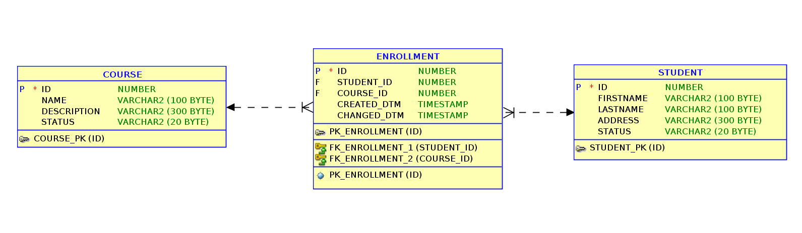

# Demonstration of JSON data processing in oracle DB using ORDS

## Prerequisites

1. Ensure oracle dba instance with ORDS installed.

1. [Download](https://github.com/sarojaraut/demo-6) this git repo `git clone git@github.com:sarojaraut/mydemo-5.git`.

1. Connect to the desired oracle schema: e.g `sql MYDBA/MYDBA@localhost:31521/mydb`

1. Run the schema setup script `@setup_student_schema.sql`.

1. Run the test data setup script `@setup_test_data.sql`

1. Run the script to create the API package `@student_api.pkb`

1. Run the script to create REST Endpoints `@student_ords_apis.sql`

_Note : Execute privilage is needed on `DBMS_RANDOM` package which is used during test data setup e.g. `grant execute on dbms_random to mydba`_

## Schema description

Table Name | Record Count | Description 
--- | --- | ---
`course`| 3 | Holds details of course.
`student`| 10 | Holds details of registered students.
`enrollment` | 18 | Holds details students enrolled for course.

## Data model

## Rest End Points

1. API `GET students/v1/` returns all data from course table in json format : https://apex.oracle.com/pls/apex/sarojapi/students/v1/

1. API `GET students/v1/:ID` all data from course table in json format : https://apex.oracle.com/pls/apex/sarojapi/students/v1/1

1. API `DELETE students/v1/:ID` deletes student and returns a json response. If student not found it returns http status code 204 and appropriate message 
`curl -i --request DELETE \
  --url https://apex.oracle.com/pls/apex/sarojapi/students/v1/41`

1. API `POST students/v1/{}` accepts students data in json format and creates the student 
`curl --request POST \
  --url https://apex.oracle.com/pls/apex/sarojapi/students/v1/ \
  --header 'content-type: application/json' \
  --data '{ 
	"firstname": "x", 
	"lastname": "X", 
	"address": "X", 
	"status": "X"
}'`

1. API `GET courses/v1/` returns all data from course table in json format : https://apex.oracle.com/pls/apex/sarojapi/courses/v1/

1. API `GET courses/v1/students` returns all course along with enrolled students in nested json format : https://apex.oracle.com/pls/apex/sarojapi/courses/v1/students 

_Note : This sample URLs are from oracle hosted free instance and might get purged. For local instances the base part of url needs to be changed e.g https://apex.oracle.com/pls/apex/ by http(s)://localhost:port/ords/._
